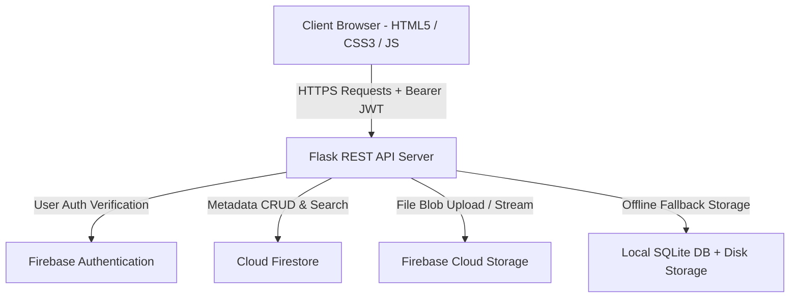

# ☁️ Cloud-Based File Storage and Sharing System

A modern, secure, full-stack web application for uploading, organizing, managing, downloading, and sharing files in the cloud. Built with **Python (Flask)**, **JavaScript (ES6+)**, **HTML5**, **CSS3**, and powered by **Google Firebase (Authentication, Cloud Storage, Cloud Firestore)**.

---

## 📑 Table of Contents

- [Overview](#-overview)
- [Key Features](#-key-features)
- [Technologies Used](#-technologies-used)
- [System Architecture](#-system-architecture)
- [Project Folder Structure](#-project-folder-structure)
- [Prerequisites](#-prerequisites)
- [Installation & Quick Start](#-installation--quick-start)
- [Firebase Setup Instructions](#-firebase-setup-instructions)
- [Environment Variables Configuration](#-environment-variables-configuration)
- [API Documentation](#-api-documentation)
- [Frontend Pages & User Flows](#-frontend-pages--user-flows)
- [Security & Data Isolation](#-security--data-isolation)
- [Screenshots & UI Showcase](#-screenshots--ui-showcase)
- [Troubleshooting & FAQs](#-troubleshooting--faqs)
- [Future Improvements](#-future-improvements)

---

## 🌟 Overview

The **Cloud-Based File Storage and Sharing System** (CloudVault) allows users to store personal files in cloud storage, inspect metadata, filter by file categories (PDFs, Images, Documents, Archives), search in real-time, generate instant public share links, and securely download or delete files with strict per-user authorization.

---

## 🚀 Key Features

### 🔐 User Authentication & Authorization
- **Secure Registration & Login**: User authentication powered by Firebase Auth and JWT session tokens.
- **Input Validation**: Client-side and server-side validation for email syntax, password strength, and field presence.
- **User Isolation**: Users can only browse, download, and delete their own files.

### 📤 File Uploads & Drag-and-Drop
- **Multi-Format Support**: Upload Documents (`.docx`, `.txt`, `.csv`, `.xlsx`), Images (`.png`, `.jpg`, `.webp`), PDFs, Videos, Audio, and Archives (`.zip`, `.tar`).
- **Interactive Drag & Drop**: Drop files anywhere onto the dashboard upload zone.
- **Live Progress Bar**: Real-time upload percentage tracking with visual progress animation.
- **File Validation**: Configurable file size limits (default 50 MB) and MIME-type classification.

### 🗂️ File Management & Storage Analytics
- **Storage Consumption Bar**: Real-time quota usage meter displaying consumed storage vs. available quota.
- **Category Breakdown**: Dynamic count badges for PDFs, Images, Documents, and Archives.
- **Dual Display Modes**: Toggle between interactive **Grid Cards View** and structured **Table List View**.
- **Live Search & Sort**: Instant filename search and multi-criteria sorting (Date, Name, Size).

### 🔗 Secure Sharing & Downloads
- **One-Click Share Links**: Generate unique public URLs for team or client sharing.
- **Clipboard Integration**: Instant copy-to-clipboard button with visual feedback.
- **Authorized Downloads**: Secure streaming and signed URL redirection.
- **Permanent Deletion**: Removes file records from Firestore metadata and permanently wipes objects from Firebase Cloud Storage.

---

## 🛠️ Technologies Used

### Frontend
- **HTML5**: Semantic layout, accessible form structures, and modal dialogs.
- **CSS3**: Modern responsive UI, glassmorphism (`backdrop-filter`), CSS variables, and keyframe animations.
- **JavaScript (Vanilla ES6+)**: Asynchronous Fetch API, `XMLHttpRequest` upload progress listeners, DOM rendering, and local session management.

### Backend
- **Python 3.10+**: Core programming language.
- **Flask**: Lightweight WSGI REST API web framework.
- **Flask-CORS**: Cross-Origin Resource Sharing middleware.
- **PyJWT & Werkzeug**: JWT authentication, password hashing, and secure filename sanitization.
- **python-dotenv**: Environment configuration loader.

### Cloud Services
- **Firebase Authentication**: User identity management and credential verification.
- **Firebase Cloud Storage**: Secure object store for binary file content.
- **Google Cloud Firestore**: NoSQL document database for structured file metadata and storage metrics.
- **Local Fallback Engine**: Automatic offline SQLite + disk storage mode for immediate local development before Firebase keys are added.

---

## 🏗️ System Architecture



---

## 📁 Project Folder Structure

```
Cloud_File_Storage_System/
│
├── frontend/                        # Web Interface Files
│   ├── index.html                   # Landing page with hero, features & stats
│   ├── login.html                   # User sign-in interface
│   ├── signup.html                  # User registration interface
│   ├── dashboard.html               # Main storage dashboard with upload & explorer
│   ├── style.css                    # Professional cloud theme stylesheet
│   └── script.js                    # Dynamic frontend application logic
│
├── backend/                         # Server & API Layer
│   ├── app.py                       # Main Flask API application entrypoint
│   ├── firebase_config.py           # Firebase Admin SDK & Cloud initialization
│   ├── requirements.txt             # Python dependencies
│   ├── .env.example                 # Environment configuration template
│   ├── .env                         # Active local environment settings
│   └── services/
│       ├── auth_service.py          # User auth, registration & JWT validation
│       └── file_service.py          # File upload, Firestore CRUD, sharing & search
│
├── app.py                           # Root runner script
└── README.md                        # Project documentation
```

---

## ⚙️ Prerequisites

1. **Python 3.10 or higher** installed on your system.
2. **pip** (Python package installer).
3. Modern Web Browser (Google Chrome, Mozilla Firefox, Microsoft Edge, Safari).
4. *(Optional for live cloud)* Google Firebase account (free Spark tier).

---

## 📦 Installation & Quick Start

### 1. Clone or Navigate to the Project Directory

```bash
cd CloudFileStorage
```

### 2. Install Python Dependencies

```bash
pip install -r backend/requirements.txt
```

### 3. Run the Backend Server

```bash
python backend/app.py
```
*Alternatively, you can run from the root:*
```bash
python app.py
```

### 4. Access the Web Application

Open your browser and navigate to:
```
http://127.0.0.1:5000/
```

> 💡 **Instant Run Notice**: The application features an automatic **Local Fallback Mode**. You can immediately register, sign in, upload files, drag & drop, search, and generate share links out of the box. Follow the section below to connect your live Google Firebase credentials anytime.

---

## 🔥 Firebase Setup Instructions

Follow these step-by-step instructions to connect Google Firebase Cloud services:

### Step 1: Create a Firebase Project
1. Open the [Firebase Console](https://console.firebase.google.com/).
2. Click **Add Project**, enter a project name (e.g., `cloud-file-storage`), and click **Continue**.
3. Disable Google Analytics (optional) and click **Create Project**.

### Step 2: Enable Firebase Authentication
1. In the left navigation menu, click **Build > Authentication**.
2. Click **Get Started**.
3. Under the **Sign-in method** tab, select **Email/Password**.
4. Enable the first toggle (**Email/Password**) and click **Save**.

### Step 3: Enable Cloud Firestore Database
1. In the left navigation menu, click **Build > Firestore Database**.
2. Click **Create Database**.
3. Choose a database location (e.g., `us-central1`) and click **Next**.
4. Select **Start in test mode** (or production mode with rules) and click **Enable**.

### Step 4: Enable Firebase Cloud Storage
1. In the left navigation menu, click **Build > Storage**.
2. Click **Get Started**.
3. Choose **Start in test mode** and click **Next**.
4. Select a Cloud Storage location and click **Done**.
5. Note your storage bucket name (e.g., `your-project-id.appspot.com` or `your-project-id.firebasestorage.app`).

### Step 5: Generate Firebase Admin Service Account Key
1. In the Firebase Console, click the ⚙️ **Gear Icon** next to **Project Overview** > **Project Settings**.
2. Navigate to the **Service accounts** tab.
3. Click the **Generate new private key** button, then confirm by clicking **Generate key**.
4. A JSON file will download (e.g., `your-project-firebase-adminsdk.json`).
5. Move and rename this file to:
   ```
   backend/firebase_credentials.json
   ```

### Step 6: Obtain Web API Key
1. In **Project Settings**, scroll down to the **General** tab.
2. Under **Your project**, copy the **Web API Key** (starts with `AIzaSy...`).

---

## ⚙️ Environment Variables Configuration

Create or update `backend/.env` with your Firebase values:

```env
# Flask Application Settings
FLASK_ENV=development
PORT=5000
SECRET_KEY=your_super_secret_jwt_key_here
ALLOWED_ORIGINS=*

# Firebase Credentials
FIREBASE_SERVICE_ACCOUNT_KEY=firebase_credentials.json
FIREBASE_STORAGE_BUCKET=your-project-id.appspot.com
FIREBASE_WEB_API_KEY=AIzaSyYourFirebaseWebApiKeyHere
FIREBASE_PROJECT_ID=your-project-id

# Storage Settings
LOCAL_FALLBACK_MODE=false
MAX_UPLOAD_SIZE_MB=50
```

---

## 📡 API Documentation

### Authentication Endpoints

#### 1. Register User
- **Endpoint**: `POST /signup`
- **Headers**: `Content-Type: application/json`
- **Request Body**:
  ```json
  {
    "name": "Alex Johnson",
    "email": "alex@example.com",
    "password": "Password123"
  }
  ```
- **Response (201 Created)**:
  ```json
  {
    "success": true,
    "message": "User registered successfully!",
    "token": "eyJhbGciOi...",
    "user": {
      "user_id": "user_a1b2c3d4",
      "name": "Alex Johnson",
      "email": "alex@example.com"
    }
  }
  ```

#### 2. User Login
- **Endpoint**: `POST /login`
- **Headers**: `Content-Type: application/json`
- **Request Body**:
  ```json
  {
    "email": "alex@example.com",
    "password": "Password123"
  }
  ```
- **Response (200 OK)**:
  ```json
  {
    "success": true,
    "message": "Login successful!",
    "token": "eyJhbGciOi...",
    "user": {
      "user_id": "user_a1b2c3d4",
      "name": "Alex Johnson",
      "email": "alex@example.com"
    }
  }
  ```

#### 3. User Logout
- **Endpoint**: `POST /logout`
- **Response (200 OK)**:
  ```json
  {
    "success": true,
    "message": "Logged out successfully."
  }
  ```

---

### File Management Endpoints

#### 4. Upload File
- **Endpoint**: `POST /upload`
- **Headers**: `Authorization: Bearer <token>`
- **Body**: `multipart/form-data` with `file` field
- **Response (201 Created)**:
  ```json
  {
    "success": true,
    "message": "File uploaded successfully!",
    "file": {
      "file_id": "c1f72a44-4841-45a8-9d29-c09a3fbfa359",
      "user_id": "user_a1b2c3d4",
      "file_name": "quarterly_budget.xlsx",
      "file_type": "application/vnd.openxmlformats-officedocument.spreadsheetml.sheet",
      "file_size": 184520,
      "file_size_formatted": "180.2 KB",
      "category": "document",
      "upload_date": "2026-08-31T21:10:00Z",
      "storage_url": "https://firebasestorage.googleapis.com/...",
      "shared_link": "http://127.0.0.1:5000/shared/c1f72a44-4841-45a8-9d29-c09a3fbfa359",
      "is_public": false
    }
  }
  ```

#### 5. Get User Files & Storage Stats
- **Endpoint**: `GET /files`
- **Headers**: `Authorization: Bearer <token>`
- **Response (200 OK)**:
  ```json
  {
    "success": true,
    "files": [ ... ],
    "stats": {
      "total_files": 12,
      "total_bytes": 14589200,
      "total_formatted": "13.91 MB",
      "categories": {
        "pdf": 4,
        "image": 5,
        "document": 2,
        "archive": 1
      }
    }
  }
  ```

#### 6. Search Files
- **Endpoint**: `GET /search?q=<query>&category=<category>`
- **Headers**: `Authorization: Bearer <token>`
- **Response (200 OK)**:
  ```json
  {
    "success": true,
    "files": [ ... ],
    "total_results": 2,
    "query": "report",
    "category": "pdf"
  }
  ```

#### 7. Download File
- **Endpoint**: `GET /download/<file_id>?token=<token>`
- **Response**: Binary file stream or 302 Redirect to signed Cloud Storage URL.

#### 8. Generate Share Link
- **Endpoint**: `POST /share/<file_id>`
- **Headers**: `Authorization: Bearer <token>`
- **Response (200 OK)**:
  ```json
  {
    "success": true,
    "message": "Share link generated successfully!",
    "shared_link": "http://127.0.0.1:5000/shared/c1f72a44-4841-45a8-9d29-c09a3fbfa359"
  }
  ```

#### 9. Delete File
- **Endpoint**: `DELETE /delete/<file_id>`
- **Headers**: `Authorization: Bearer <token>`
- **Response (200 OK)**:
  ```json
  {
    "success": true,
    "message": "File deleted successfully!"
  }
  ```

---

## 🔒 Security & Data Isolation

1. **Token-Based Authentication**: All private routes enforce `Authorization: Bearer <token>` validation.
2. **Access Isolation**: Backend queries strictly scope file lookups by the authenticated `user_id`. Attempting to access another user's `file_id` results in a `403 Forbidden` or `404 Not Found`.
3. **Filename Sanitization**: Uploaded filenames pass through `werkzeug.utils.secure_filename` to prevent path traversal vulnerabilities.
4. **Quota and File Size Validation**: Server enforces maximum file sizes (default 50 MB) before processing uploads.

---

## 🖼️ Screenshots & UI Showcase

| Landing Page | User Dashboard |
| :---: | :---: |
| *Modern cloud hero banner, feature highlights, and interactive preview cards* | *Storage usage bar, drag-and-drop upload zone, and searchable file explorer* |

| File Upload & Drag-and-Drop | Share Modal & Link Generator |
| :---: | :---: |
| *Live percentage upload progress bar with category classification* | *One-click shareable URL generation with clipboard feedback* |

---

## ❓ Troubleshooting & FAQs

#### Q: How do I run the project without setting up Firebase right away?
> **A:** The system includes a zero-config **Local Fallback Mode**. Simply run `python backend/app.py` and start using the app. User credentials and files will be securely saved in the local `data/` and `uploads/` directories.

#### Q: Can I run frontend and backend on different ports?
> **A:** Yes. The Flask backend enables `Flask-CORS` for all origins. If you run frontend with Live Server (e.g. port 5500) and backend on port 5000, `script.js` will automatically communicate with `http://127.0.0.1:5000`.

#### Q: Where are uploaded files stored in Firebase?
> **A:** In Firebase Cloud Storage, files are stored under `users/{user_id}/{file_id}_{filename}` to ensure structured isolation.

---

## 🔮 Future Improvements

- [ ] End-to-end client-side file encryption with AES-GCM prior to transmission.
- [ ] Folder hierarchies and nested directory creation.
- [ ] Expiring share links with optional password protection.
- [ ] Image and PDF in-browser preview modals.
- [ ] Bulk file upload and batch zip archive download.

---

## 📄 License

This project is licensed under the **MIT License**.
